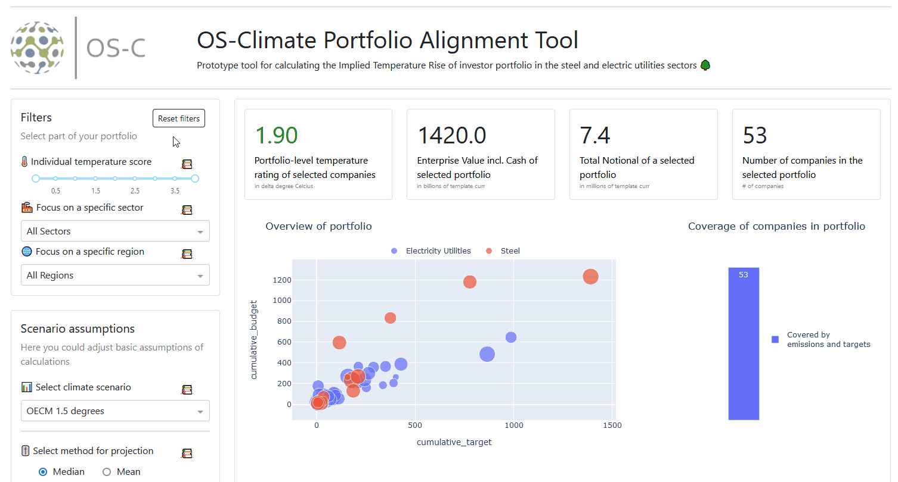

# ITR
This Python module implements the ITR methodology.

## Getting started with the user interface:
If you use Anaconda environments, open an Anaconda prompt window, navigate to the root of the ITR release (ITR-develop) and run:
```
conda env create -f environment.yml
conda activate itr_ui
```

For virtual environments, open a command prompt/terminal window, navigate to the root of the ITR release and run
```
python3 -m venv itr_ui
```
On Unix or MacOS, activate the environment with
```
source itr_ui/bin/activate
```
On Windows, activate the environment with
```
itr_ui\Scripts\activate
```
Next, run:
```
python3 -m pip install --upgrade pip
pip install -r requirements.txt
pip install -e .
```

Now you are ready to change to the examples directory and run the tool:
```
cd examples
python3 ITR_UI.py
python3 ITR_UI.py "data/20230106 ITR V2 Sample Data.xlsx"
```

Note the python commands are ```python``` for windows and ``python3`` for linux/mac.  If no file is specified, the tool uses a default, small ITR dataset.  With a filename given, the ITR tool will load data from that dataset.  The 20230106 data template has over 120 companies across nearly a dozen sectors.

Finally, open a browser window and navigate to `http://127.0.0.1:8050/` to access the user interface.

## Jupyter notebooks
To work with notebooks from the 'examples' directory please register the kernel from your virtual environment
such that it is available in Jupyter. Kernels from Anaconda environments will be available by default. Replace
`<env_name>` in the following command by your environment name (`itr_ui` or `itr_env`) and run it in your environment.
```
python -m ipykernel install --user --name=<env_name>
```
Start Jupyter by activating your environment and running
```
jupyter-notebook
```

## Getting started for Contributors/Developers:
If you use Anaconda environments, open an Anaconda prompt window, navigate to the project directory and run:
```
conda env create -f environment.yml
conda activate itr_env
```

For virtual environments, open a command prompt/terminal window, navigate to the project directory and run:
```
python3 -m venv itr_env
```
On Unix or MacOS, activate the environment with
```
source itr_env/bin/activate
```
On Windows, activate the environment with
```
itr_env\Scripts\activate
```
Next, run:
```
python3 -m pip install --upgrade pip
pip install -r requirements.txt
pip install -e .[dev]
```

## User Interface
