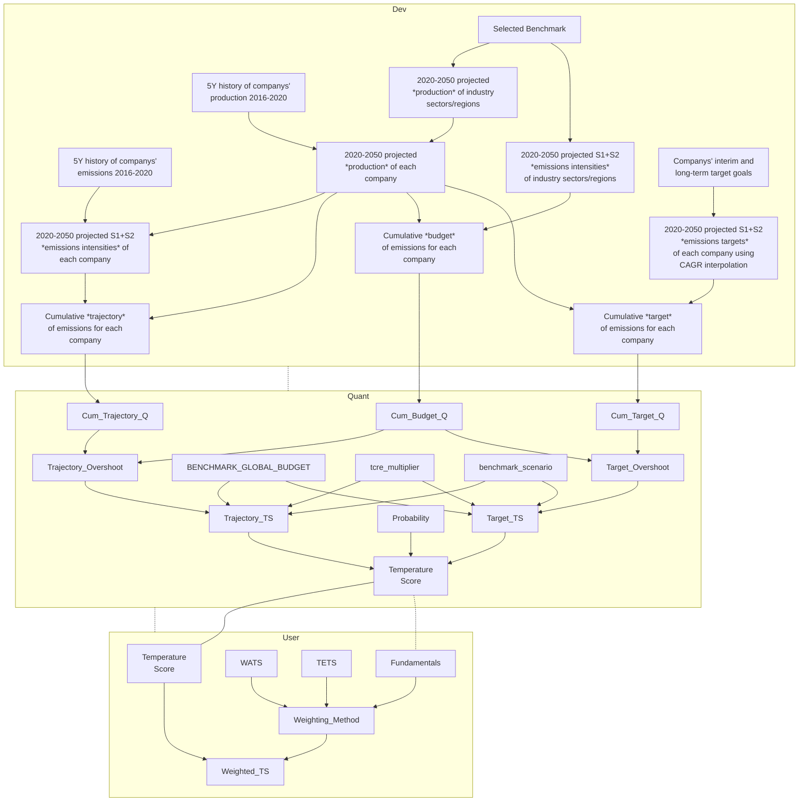

```mermaid
  flowchart TB
      subgraph Dev
        direction LR
        Em_Hist[5Y history of companys'<br> emissions 2016-2020]-->Trajectory_Proj;
        Pr_Hist[5Y history of companys'<br> production 2016-2020]-->Production_Proj;
        Bm[Selected Benchmark]-->Bm_Pr;
        Bm[Selected Benchmark]-->Bm_Ei;
        Bm_Pr[2020-2050 projected<br> *production* of industry sectors/regions]-->Production_Proj;
        Ei_Target[Companys' interim and <br>long-term target goals]-->Target_Proj;
        Trajectory_Proj[2020-2050 projected S1+S2<br> *emissions intensities* of each company]-->Cum_Trajectory
        Production_Proj[2020-2050 projected<br> *production* of each company]
        Production_Proj-->Trajectory_Proj
        Production_Proj-->Cum_Trajectory
        Production_Proj-->Cum_Budget
        Production_Proj-->Cum_Target
        Bm_Ei[2020-2050 projected S1+S2<br> *emissions intensities*<br> of industry sectors/regions]-->Cum_Budget
        Target_Proj[2020-2050 projected S1+S2<br> *emissions targets*<br> of each company using CAGR interpolation]-->Cum_Target
        Cum_Trajectory[Cumulative *trajectory*<br> of emissions for each company]
        Cum_Budget[Cumulative *budget*<br> of emissions for each company]
        Cum_Target[Cumulative *target*<br> of emissions for each company]
      end
      subgraph Quant
        direction LR
        Cum_Trajectory-->Cum_Trajectory_Q
        Cum_Budget-->Cum_Budget_Q
        Cum_Target-->Cum_Target_Q
        Cum_Trajectory_Q-->Trajectory_Overshoot
        Cum_Budget_Q-->Trajectory_Overshoot
        Cum_Budget_Q-->Target_Overshoot
        Cum_Target_Q-->Target_Overshoot
        BENCHMARK_GLOBAL_BUDGET-->Trajectory_TS
        BENCHMARK_GLOBAL_BUDGET-->Target_TS
        tcre_multiplier-->Trajectory_TS
        tcre_multiplier-->Target_TS
        benchmark_scenario-->Trajectory_TS
        benchmark_scenario-->Target_TS
        Trajectory_Overshoot-->Trajectory_TS
        Target_Overshoot-->Target_TS
        Trajectory_TS-->TS
        Target_TS-->TS
        Probability-->TS[Temperature<br>Score]
      end
      subgraph User
        direction LR
        TS---TS_U
        TS_U[Temperature<br>Score]-->Weighted_TS
        Weighting_Method-->Weighted_TS
        WATS-->Weighting_Method
        TETS-->Weighting_Method
        Fundamentals-->Weighting_Method
        TS -.- Fundamentals
      end
      Dev-.-Quant
      Quant-.-User
```
